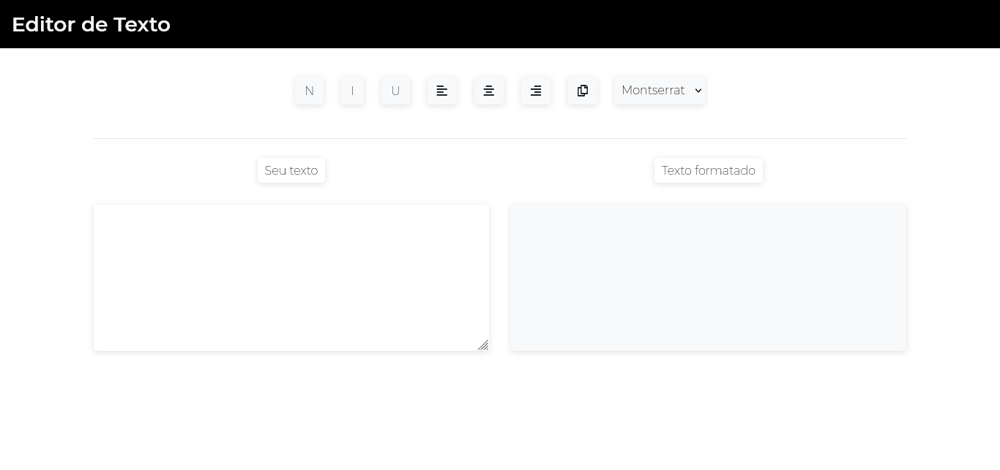

# Text Editor
A web app for text editing builded with vanilla js.

## Table of contents

- [Overview](#overview)
  - [Screenshot](#screenshot)
  - [Links](#links)
- [My process](#my-process)
  - [Built with](#built-with)
  - [What I learned](#what-i-learned)
- [Author](#author)

## Overview

### The challenge

-I had more practice with dom manipulation and using a external js pluggin to copy the text content.

### Screenshot

### Links

- Solution URL: [Github repository](https://github.com/RafaelGLeal/Text-Editor)
- Live Site URL: [Live Site](https://github.com/RafaelGLeal/Text-Editor)

### Built with

- Semantic HTML5 markup
- CSS custom properties
- Javascript
- Bootstrap

### What I learned

- I had more practice with dom manipulation and using a external js pluggin to copy the text content.

## Author

- Website - [Rafael G. Leal](https://github.com/RafaelGLeal)
